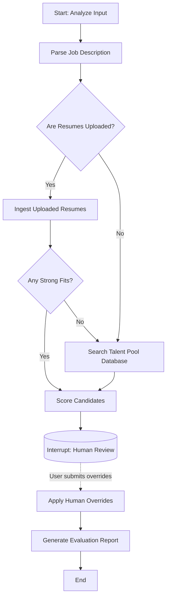

# NexHire AI — Agentic Resume-JD Matching System

A modern, modular AI agent for parsing, matching, and evaluating resumes against job descriptions. Built using **LangGraph**, **Google Gemini LLM**, **FAISS**, **BM25**, and **Streamlit**.

NexHire AI orchestrates a stateful evaluation process, featuring **5-dimension rubric scoring**, **Human-in-the-loop (HIL) overrides**, **PII masking**, and automatic **Talent Pool retrieval**.

## Key Features

- **Agentic Orchestration (LangGraph)**: A stateful agent coordinating the extraction, retrieval, scoring, and review phases. The agent automatically triggers a talent pool search if no uploaded resume is a strong fit.
- **5-Dimension Rubric Scoring**: Deep LLM evaluation across Skills (30%), Experience (25%), Education (15%), Projects (20%), and Communication (10%) with Hire/No-Hire mapping.
- **Hybrid Search Retrieval**: Two-tower FAISS semantic + BM25 keyword retrieval, fused with Reciprocal Rank Fusion (RRF).
- **Multi-Format Parsing**: Extracts structured data from PDF, DOCX, TXT, and **LinkedIn Export JSONs**.
- **Security & Privacy**: Built-in PII masking to redact emails/phones *before* any data is sent to the cloud API to maximize privacy, and structured output schemas to prevent prompt injection.
- **Human-in-the-Loop & Audit Logging**: Review and override LLM scores directly in the UI. Full JSON audit trails are generated per session, acting as a permanent record of HR decisions to satisfy transparency requirements.

## System Architecture

### Agent Control Flow

The core of NexHire AI is powered by a LangGraph state machine. Here is the control flow of the agent:



### Core Components

1. **Agent Graph & Tools (`agent/`)**:
   - `graph.py`: The LangGraph state machine orchestrating the workflow.
   - `state.py`: Defines the internal state schema shared across steps.
   - `tools.py`: Wraps modules (parsing, searching, scoring) into LangGraph tool nodes.
   - `audit.py`: Handles overriding and logging HR decisions.
2. **Embedding & Matching (`resume_model/embedding_matching.py`)**: The `HybridResumeRetriever` component handling FAISS and BM25 offline search over bulk candidate records.
3. **LLM Fit Scorer (`resume_model/llm_fit_scorer.py`)**: Enforces the strict 5-dimension scoring rubric via Gemini LLM.
4. **Data Extraction & API Integrations**: Google Gemini integrations to convert PDFs and DOCX files to structured attributes.
5. **Security & PII (`security/pii_masker.py`)**: Pre-processing step before API calls to prevent sensitive data leaks.

## Tech Stack

- **Orchestration**: LangGraph — *Chosen for its native support for stateful 'Human-in-the-Loop' interactions and complex branching logic.*
- **LLM**: Google Gemini API (gemini-3.1-flash-lite-preview)
- **Vector Search**: FAISS + Rank-BM25
- **Frontend**: Streamlit
- **Parsing**: PyMuPDF, python-docx
- **Reporting**: Jinja2 (HTML Generation)

## Getting Started

### 1. Clone the Repository

```bash
git clone https://github.com/Shreya-singh22/NexHire.git
cd NexHire
```

### 2. Install Dependencies

```bash
pip install -r requirements.txt
```

### 3. Configure Environment Variables

Create a `.env` file in the project root:

```dotenv
GEMINI_API_KEY=your-google-gemini-api-key-here
```

### 4. Add Data & Build Index

1. Place candidate resumes (`.pdf`, `.docx`, `.json`) in the `resume_data/` folder.
2. Build the FAISS and BM25 offline indexes by running:

```bash
python build_index.py
```

*This extracts structured data via Gemini and builds indices in `index_store/`.*

## Running the Streamlit App

```bash
streamlit run streamlit_app.py
```

**Features in the UI:**

- **Upload**: Provide a Job Description and Candidate Resumes (or LinkedIn JSON exports).
- **Agent Workflow**: The LangGraph agent will automatically parse inputs, retrieve candidates from the internal talent pool (if needed), and score them against the rubric.
- **Review & Override**: Use the sliders to override specific dimension scores (e.g., adjust "Skills Match" from 7 to 9 based on interview notes).
- **Download**: Generate and download HTML evaluation reports.

## Project Structure

```text
NexHire/
├── agent/                          # LangGraph agent orchestrator & state
├── resume_model/                   # Retrieval, Scoring, API integration, Text extraction
├── security/                       # Centralized PII masking + input sanitization
├── templates/                      # Jinja2 HTML report templates
├── audit_logs/                     # Generated at runtime (HIL overrides)
├── index_store/                    # FAISS & BM25 pre-built indexes
├── streamlit_app.py                # Streamlit Interactive UI
├── requirements.txt                # Python dependencies
└── .env                            # Environment variables
```

## Contributing

Pull requests are welcome! For major architectural changes, please open an issue first to discuss what you would like to change.

## License
All rights reserved.

## Contact

For questions or demo requests, contact [sanchit.pdy@gmail.com].
